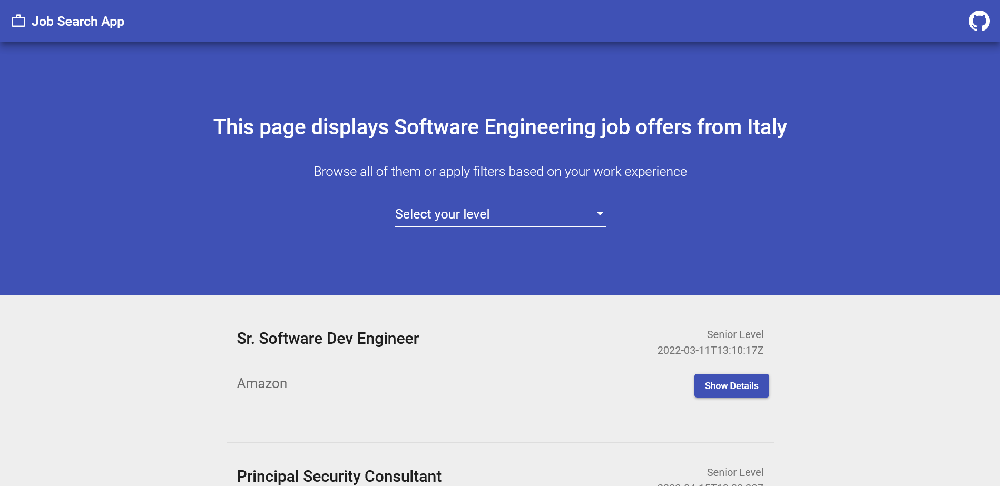
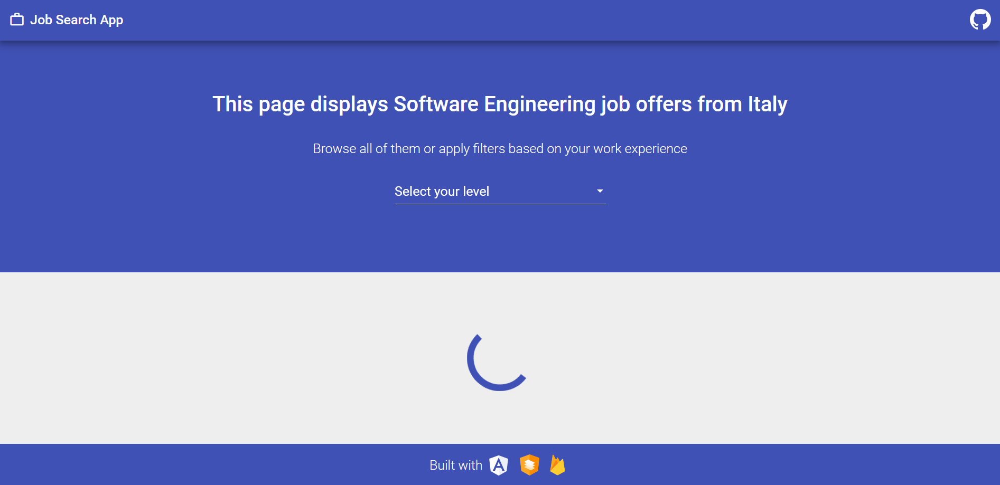
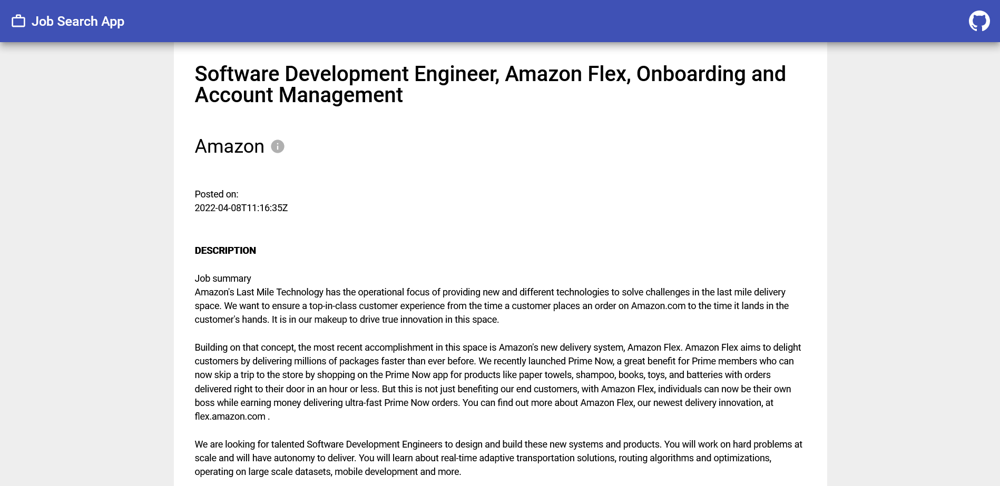
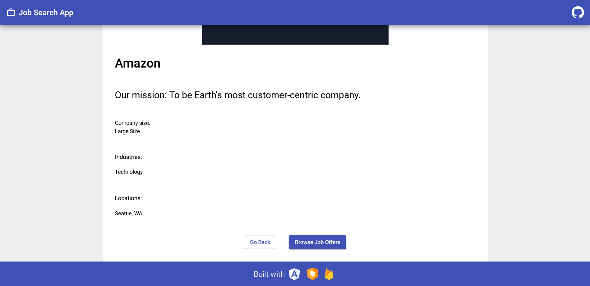

# Progetto Angular per Start2Impact

## Descrizione

Questo progetto sviluppato in Angular permette di visualizzare le offerte di lavoro disponibili in Italia per Software Engineering. Le informazioni vengono prelevate attraverso un'api di TheMuse ed è possibile filtrare la ricerca, personalizzando la chiamata, in base all'esperienza lavorativa.

L'app è stata progettata per avere diversi componenti: oltre all'header e al footer abbiamo delle carte con le singole offerte e due pagine di dettaglio con informazioni sull'offerta specifica e sull'azienda che la offre. Tutte le offerte sono raccolte in una dashboard che prevede anche la paginazione.

Esteticamente l'app segue il Material Design di Google e, nello specifico, fa uso di Angular Material per il design generale da cui prende la toolbar, le carte, i bottoni, le icone e uno spinner. Quest'ultimo viene usato come feedback visivo per indicare i tempi di caricamento dell'api.

Il deploy è stato effettuato su Firebase.

### Costruito con

- HTML
- CSS
- TypeScript
- Angular
- Material Design
- Firebase

### Screenshots

## Link

[Link per provare l'app](https://s2i-jobsearchapp.web.app/)

## Istruzioni per provare l'app in locale

Per provare l'app in locale è necessario avere innanzitutto gli strumenti di Angular da riga di comando, che si possono installare con `npm install -g @angular/cli`.

A questo punto si può clonare il progetto, soddisfare le dependencies di npm ed utilizzare i comandi di seguito riportati.

### Dev server

Eseguire `ng serve -o` per avviare il dev server. Di default sarà avviato su `http://localhost:4200/`. Ad ogni salvataggio il sito si ricarica in automatico.

### Build

Eseguire `ng build` per compilare il progetto. Il risultato verrà inserito nella cartella `dist/`.

### Unit tests

Eseguire `ng test` per eseguire degli unit test con [Karma](https://karma-runner.github.io). Di base questo avviene con Chrome, ma il progetto è già stato configurato per essere testato anche con Edge e Firefox attraverso le flag `--browsers Edge|Firefox`. Per qualsiasi altro browser cercare relativi plugin.

### End-to-end tests

Eseguire `ng e2e` per avviare dei test end-to-end con una piattaforma a tua scelta. Per usare questo comando è necessario installare prima un pacchetto per abilitare le funzionalità end-to-end.
